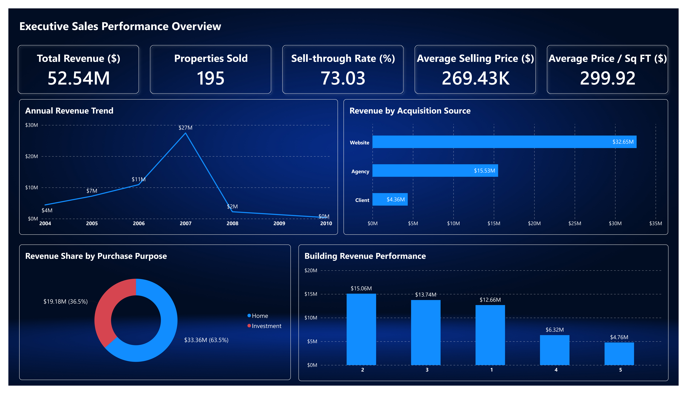
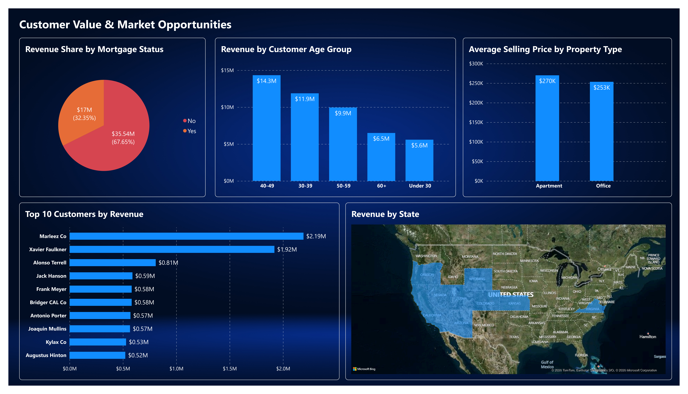

# Real Estate Sales & Customer Analysis

## Project Overview

This project analyzes **real estate sales, property inventory, and customer behavior** using **Excel, Power Query, MySQL, and Power BI**.

The analysis focuses on sales performance, property sell-through, building performance, customer acquisition, purchase purpose, mortgage behavior, customer age, geography, repeat buyers, and property type. The project follows an end-to-end analytics workflow: raw data is cleaned and transformed in Excel/Power Query, structured and analyzed in MySQL, summarized through SQL reporting views, and presented in an interactive Power BI dashboard.

The objective is to convert transactional and customer data into clear business insights that can support decisions around **sales strategy, customer targeting, property performance, and market opportunities**.

---

## Business Questions

The analysis aims to answer the following questions:

* How many properties are available, sold, and unsold?
* What is the overall property sell-through rate?
* How much revenue has been generated, and what is the average selling price?
* How have sales volume and revenue changed over time?
* Which buildings perform best in terms of sales, revenue, and sell-through rate?
* Which acquisition sources generate the strongest customer and revenue performance?
* How do home buyers and investment buyers differ?
* How does mortgage usage relate to purchase value and property size?
* Which customer age groups generate the most revenue?
* Which countries and U.S. states contribute the most revenue?
* Who are the highest-value and most frequent customers?
* How do apartments and offices compare in sales performance?

---

## Tools & Technologies

* **Excel** — initial data review and workbook-based preparation
* **Power Query** — data cleaning, transformation, missing-value handling, and standardization
* **MySQL** — relational database creation, data validation, business analysis, joins, CTEs, and reporting views
* **SQL** — KPI calculation, segmentation, ranking, aggregation, and reporting-layer development
* **Power BI** — dashboard development, visual analysis, and business storytelling
* **Power BI Data Model** — customer-to-property relationship and date structure for reporting

---

## Project Workflow

### 1. Data Understanding

The project uses two related datasets:

* `properties`
* `customers`

The property dataset contains information on property identity, building, sale date, property type, area, price, sale status, and customer ID.

The customer dataset contains customer identity, entity type, demographic information, location, purchase purpose, satisfaction, mortgage status, and acquisition source.

The relationship between the two datasets is:

```text
customers.customer_id  1 ────── *  properties.customer_id
```

---

### 2. Data Cleaning & Transformation

Data cleaning was performed primarily with **Excel and Power Query** before loading the data into MySQL.

Key preparation steps included:

* Standardizing column names into clear `snake_case` naming
* Trimming and cleaning text fields
* Handling structural missing values
* Setting unsold-property `sale_date` and `customer_id` values to null
* Standardizing property sale status
* Converting date fields into proper date formats
* Creating a surrogate `property_key` because `property_id` was not unique
* Validating customer IDs before creating the database relationship
* Preserving legitimate missing demographic fields for company/entity customers

The cleaned data was exported to CSV for database loading.

---

### 3. MySQL Database Preparation

A relational database named:

```sql
real_estate_data
```

was created in MySQL.

The final model contains two core tables:

```text
customers
properties
```

A foreign-key relationship was created from:

```sql
properties.customer_id
```

to:

```sql
customers.customer_id
```

Additional validation was performed to confirm that no unmatched customer IDs remained before creating the relationship.

---

### 4. SQL Business Analysis

Twelve business questions were answered using SQL.

The analysis used:

* Aggregations
* Conditional logic
* `JOIN`
* `CTE`
* `GROUP BY`
* Date functions
* Customer segmentation
* Revenue calculations
* Sell-through calculations
* Ranking with `DENSE_RANK`
* Geographic analysis

The SQL analysis was separated from the reporting layer so that the business logic remained reusable and easy to audit.

---

### 5. SQL Reporting Views

Because the dashboard was designed to rely mainly on SQL-prepared metrics rather than custom DAX measures, a reporting layer was created using MySQL views.

Key reporting views include:

* `vw_sales_kpis`
* `vw_yearly_sales`
* `vw_building_performance`
* `vw_customer_segments`
* `vw_age_group_performance`
* `vw_geographic_performance`
* `vw_top_customers`
* `vw_property_type_performance`

These views provide clean, dashboard-ready datasets for Power BI.

---

### 6. Power BI Dashboard

The final Power BI report contains two pages.

#### Executive Sales Performance Overview



This page summarizes overall sales performance through:

* Total Revenue
* Properties Sold
* Sell-through Rate
* Average Selling Price
* Average Price per Sq Ft
* Revenue Trend by Year
* Revenue by Acquisition Source
* Revenue Share by Purchase Purpose
* Revenue by Building

#### Customer Value & Market Opportunities



This page focuses on customer and market behavior through:

* Revenue Share by Mortgage Status
* Revenue by Customer Age Group
* Geographic Revenue Distribution
* Top Customers by Revenue
* Average Selling Price by Property Type

**[View the full dashboard PDF](assets/real_estate_dashboard.pdf)**

---

## Key Findings

### Strong Overall Sales Performance

The portfolio contained **267 properties**, of which **195 were sold** and **72 remained unsold**.

This produced a **73.03% sell-through rate**.

Sold properties generated approximately **$52.54M in total revenue**, with an average selling price of approximately **$269.43K**.

---

### Revenue Peaked in 2007

Sales activity increased substantially through 2007.

In 2007:

* **102 properties** were sold
* Revenue reached approximately **$27.45M**
* Average selling price remained around **$269K**

The revenue peak was therefore driven primarily by **higher transaction volume rather than a major increase in average price**.

Because the dataset contains limited observations after 2007, later-year declines should be interpreted cautiously.

---

### Building 2 Was the Strongest Performer

Building 2 recorded:

* **54 properties sold**
* Approximately **$15.06M in revenue**
* **94.74% sell-through rate**
* Average selling price of approximately **$278.97K**

Building 5 was the weakest performer, with only **19 of 52 properties sold** and a sell-through rate of approximately **36.54%**.

---

### Website Acquisition Generated the Most Value

Customers acquired through the website generated approximately **$32.65M in revenue**, substantially more than Agency or Client acquisition.

Website-acquired customers also recorded the highest average purchase value at approximately **$274.39K**.

This indicates that the website was associated with both **higher customer volume and stronger transaction value**.

---

### Home Buyers Generated More Revenue

Home buyers generated approximately **$33.36M**, compared with approximately **$19.18M** from investment buyers.

Home buyers also purchased:

* Higher-value properties on average
* Larger properties on average

However, investment buyers demonstrated stronger repeat-purchase behavior, with **76 purchases from 50 customers**.

---

### Mortgage Customers Purchased Slightly Higher-Value Properties

Customers without mortgages generated approximately **$35.54M in total revenue**, largely because they represented the larger customer group.

Mortgage customers, however, had:

* Slightly higher average purchase value
* Slightly larger average property size

This suggests that mortgage usage may be associated with somewhat larger or higher-value purchases.

---

### Customers Aged 40–49 Generated the Most Revenue

The **40–49** age group generated approximately **$14.32M**, the highest total revenue among the age segments.

Customers under 30 generated lower total revenue because they represented a smaller segment, but they recorded the **highest average purchase value**, at approximately **$310.56K**.

---

### Revenue Was Highly Concentrated Geographically

The United States accounted for the large majority of customer activity and revenue.

Within the U.S., **California** was the dominant market, contributing approximately **$33M in revenue**.

Nevada was a distant second.

This demonstrates strong geographic concentration and potential dependence on a single major market.

---

### Repeat Customers Represent Significant Value

Several customers purchased multiple properties.

The highest-ranked customer, **Marleez Co**, purchased **9 properties** totaling approximately **$2.19M**.

The second-highest customer, **Xavier Faulkner**, purchased **7 properties** totaling approximately **$1.92M**.

This shows that repeat customers can make a disproportionately large contribution to total revenue.

---

### Apartments Dominated the Portfolio

Apartments represented the overwhelming majority of available properties and generated approximately **$50.77M in revenue**.

Office properties generated approximately **$1.77M**.

Offices showed a higher sell-through rate, but only **8 office properties** were available in the dataset, so this result should not be generalized without additional data.

---

## Main Insights

1. **Sales performance is primarily volume-driven.** Revenue peaked when transaction volume was highest rather than when average prices increased substantially.

2. **Building performance varies significantly.** Building 2 combines strong revenue, sales volume, and sell-through, while Building 5 requires further investigation.

3. **The website is the strongest acquisition channel in the dataset.** It generates the highest customer volume, total revenue, and average purchase value.

4. **Home buyers and investors behave differently.** Home buyers purchase larger and more expensive properties, while investors demonstrate stronger repeat-purchase behavior.

5. **Customer age matters for both volume and value.** Customers aged 40–49 generate the most total revenue, while younger customers show unusually high average purchase values.

6. **Revenue is geographically concentrated.** California accounts for a large share of the portfolio's revenue, creating both a strong market position and concentration risk.

7. **Repeat customers are strategically important.** A relatively small group of multi-property buyers contributes substantial revenue.

8. **Apartments are the core revenue-generating property type.** Office results are interesting but based on a very small sample.

---

## Business Recommendations

* **Continue prioritizing website acquisition** while identifying which digital campaigns and customer journeys contribute to high-value purchases.

* **Investigate Building 5** to determine whether pricing, positioning, property characteristics, or marketing strategy explain its low sell-through rate.

* **Develop separate strategies for home buyers and investors.** Home buyers should be targeted with larger and higher-value properties, while investors should receive retention and repeat-purchase offers.

* **Create a repeat-buyer strategy** through relationship management, loyalty incentives, early access, or personalized property recommendations.

* **Maintain financing support for mortgage customers**, who show slightly higher average purchase values and property sizes.

* **Prioritize customers aged 40–49 for revenue-focused campaigns**, while exploring the smaller but high-value under-30 segment.

* **Protect the California market while testing expansion into secondary markets** to reduce geographic concentration risk.

* **Keep apartments as the primary product focus**, while treating office-property performance as exploratory until more observations are available.

---

## Repository Structure

```text
real-estate-sales-customer-analysis/
│
├── README.md
│
├── data/
│   ├── raw/
│   │   ├── customers.csv
│   │   └── properties.csv
│   └── cleaned/
│       ├── customers_clean.csv
│       └── properties_clean.csv
│
├── excel/
│   └── real_estate_data_cleaning.xlsx
│
├── sql/
│   ├── data_cleaning.sql
│   ├── exploratory_data_analysis.sql
│   └── reporting_views.sql
│
├── power_bi/
│   └── real_estate_sales_customer_analysis.pbix
│
└── assets/
    ├── executive_sales_performance_overview.png
    ├── customer_value_market_opportunities.png
    └── real_estate_dashboard.pdf
```

---

## Skills Demonstrated

### Excel & Power Query

* Data cleaning
* Data transformation
* Missing-value handling
* Data-type correction
* Text standardization
* Relational-data preparation
* Exporting clean analysis-ready datasets

### SQL & MySQL

* Database creation
* Table design
* Primary and foreign keys
* Data validation
* Joins
* Common Table Expressions (CTEs)
* Aggregations
* Conditional logic
* Date analysis
* Ranking functions
* Customer segmentation
* KPI calculation
* Reporting views

### Power BI

* MySQL data connection
* Data modeling
* KPI visualization
* Sales trend analysis
* Customer analysis
* Geographic analysis
* Dashboard layout and formatting
* Business storytelling
* Tooltip design

### Business Analytics

* Sales performance analysis
* Revenue analysis
* Property inventory analysis
* Sell-through analysis
* Customer segmentation
* Acquisition-channel analysis
* Geographic market analysis
* Customer-value analysis
* Repeat-purchase analysis
* Property-performance analysis
* Business recommendation development

---

## Conclusion

This project demonstrates an end-to-end analytics workflow that transforms raw real estate and customer data into structured business insights using **Excel, Power Query, MySQL, SQL, and Power BI**.

The analysis identified the major drivers of revenue and sales performance, including strong website acquisition, high-performing buildings, valuable customer segments, repeat buyers, and geographic concentration.

The final dashboard connects these findings to practical business decisions by highlighting where the company performs strongly, where performance requires investigation, and where future growth opportunities may exist.
